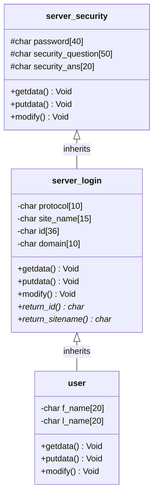
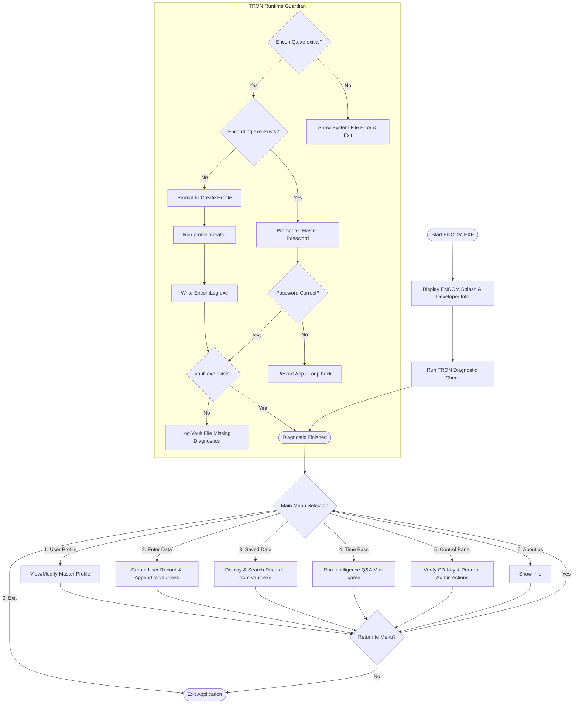

# Encom: Smart Password Manager

Encom is a command-line utility for secure password storage and credentials management. Originally designed as a Class 12 CBSE Computer Science project, it is written in legacy C++ (Turbo C++ / Borland C++ dialect) and runs in a DOS-based environment. 

The application implements customized file serialization, runtime integrity checks (code-named **TRON**), a proprietary licensing algorithm, and menu-driven command navigation.

---

## 🏗️ Architecture & Class Design

The core architecture follows an object-oriented inheritance model to represent user records, coupled with a separate class for the master profile.

### 1. Object Inheritance Hierarchy
The password storage system is structured around the `user` class, which inherits data fields and behavior from `server_login`, which in turn inherits from `server_security`.



* **`server_security`**: Encapsulates credential password and recovery questions.
* **`server_login`**: Adds routing information (Protocol, Domain, Site Name, and Login ID).
* **`user`**: Appends the owner's personal name parameters (First & Last Name).

### 2. Primary Configuration
* **`login_profile`**: A standalone class containing the system user’s login profile details, used to restrict master access to the password vault.

---

## 🔄 Runtime Flow & Execution Cycle

When the application boots, it executes an initialization check (TRON) before launching the main interface.



---

## 🔒 Security Concepts & Data Storage

Encom employs basic security practices tailored for offline DOS environments:

### 🛡️ File Obscurity (Disguised File Names)
To prevent unauthorized users from viewing the raw credential records, Encom saves system files using the `.exe` extension:
* **`EncomLog.exe`**: Contains the serialized binary payload representing the `login_profile` instance.
* **`vault.exe`**: Contains multiple concatenated binary payloads representing `user` class instances.
* **`EncomQ.exe`**: A zero-byte file used as an application execution lock (runtime validation key).

> [!NOTE]
> Even though these files end in `.exe`, they are not actual executables; they are binary database files containing raw struct data written using stream writes (`fstream::write`).

### 💿 CD Key / License Key Verification Logic
The **Control Panel** options require an application validation key. The program tests this key using a specific cryptographic checksum constraint logic written in the `licence_key()` function.

For a 9-character key `K` (e.g., `EXaP-ASBJ`), the validation checks:
1. **Rule 1 (Characters index 1 and 2)**: The sum of digits of ASCII values for `K[1]` and `K[2]` must be equal.
   $$\text{digit\_sum}(\text{ASCII}(K[1])) == \text{digit\_sum}(\text{ASCII}(K[2]))$$
2. **Rule 2 (Characters index 0 and 3)**: The sum of ASCII values for `K[0]` and `K[3]` must be odd.
   $$(\text{ASCII}(K[0]) + \text{ASCII}(K[3])) \pmod 2 == 1$$
3. **Rule 3 (Characters index 5 and 8)**: The sum of digits of ASCII values for `K[5]` and `K[8]` must be equal.
   $$\text{digit\_sum}(\text{ASCII}(K[5])) == \text{digit\_sum}(\text{ASCII}(K[8]))$$
4. **Rule 4 (Characters index 6 and 7)**: The sum of ASCII values for `K[6]` and `K[7]` must be odd.
   $$(\text{ASCII}(K[6]) + \text{ASCII}(K[7])) \pmod 2 == 1$$

#### CD Key Code Verification Process Trace (`EXaP-ASBJ`):
| Step Check | Characters | ASCII Values | Calculation | Validation Result |
| :--- | :--- | :--- | :--- | :--- |
| **Check 1** | `X` & `a` | 88 & 97 | $\text{digit\_sum}(88) \rightarrow 8+8=16$<br>$\text{digit\_sum}(97) \rightarrow 9+7=16$ | **Passed** ($16 == 16$) |
| **Check 2** | `E` & `P` | 69 & 80 | $69 + 80 = 149 \pmod 2$ | **Passed** (Odd) |
| **Check 3** | `A` & `J` | 65 & 74 | $\text{digit\_sum}(65) \rightarrow 6+5=11$<br>$\text{digit\_sum}(74) \rightarrow 7+4=11$ | **Passed** ($11 == 11$) |
| **Check 4** | `S` & `B` | 83 & 66 | $83 + 66 = 149 \pmod 2$ | **Passed** (Odd) |

---

## 🛠️ Project Setup & Compilation Guide

### 📋 Prerequisites
Because this project uses retro MS-DOS libraries (e.g., `conio.h`, `dos.h`, older non-templated `fstream.h`), compiling it directly on modern GCC/Clang compilers will fail due to deprecated headers.

You need:
1. **DOSBox** (an x86 emulator) or **C++ Compiler for DOS**.
2. **Turbo C++ 3.0** or **Borland C++ Compiler**.

### 💻 Local Development Setup (Using Turbo C++ in DOSBox)
1. **Download and Install DOSBox** on your host OS.
2. **Download Turbo C++** files and place them in a local folder (e.g., `C:\TurboC++`).
3. **Mount the project directory** inside DOSBox:
   ```bash
   mount c C:\TurboC++
   c:
   cd tc\bin
   ```
4. Copy the code files (`ENCOM.CPP`) and resource files to your mounted directory.
5. Create an empty file named `EncomQ.exe` in the same directory:
   * *In DOSBox command prompt:*
     ```bash
     type nul > EncomQ.exe
     ```
6. Open Turbo C++ (`tc.exe`):
   ```bash
   tc.exe
   ```
7. In the IDE, load `ENCOM.CPP` using `File -> Open`.
8. Compile and build the binary by pressing **`Alt + F9`** (Compile) followed by **`Ctrl + F9`** (Run).

---

## 📋 Menu Details

1. **User Profile**: Access the current master profile status (`EncomLog.exe`). You can review credentials or update the master authentication settings.
2. **Enter Data**: Create a new record containing website URL, service transfer protocols (`http`, `ftp`), registration emails/IDs, password, and security configuration. The record is serialized and appended into `vault.exe`.
3. **Saved Data**: Lists the entries. Selecting a site displays its details. You can edit a selected credentials node or delete it.
4. **Time Pass**: A fun easter egg module where a mock AI system gives a deterministic `Yes`/`No` response based on character ASCII summation weights.
5. **Control Panel**: Enter the master license key to perform admin tasks:
   * Deleting files to corrupt the application.
   * Resetting user login database profiles.
   * Purging the saved credentials vault.
6. **About us**: Displays the splash information, developer name, and support handles.
0. **Exit**: Gracefully releases files and exits the process.
